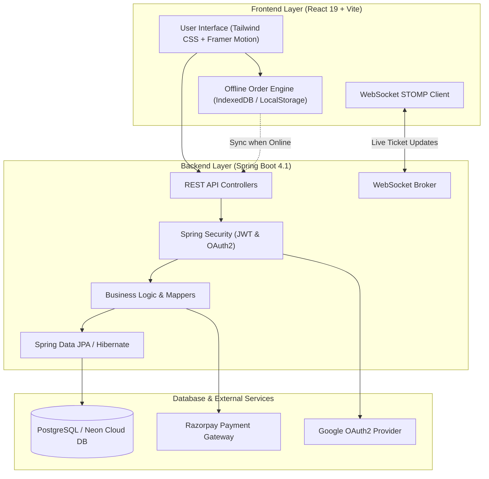
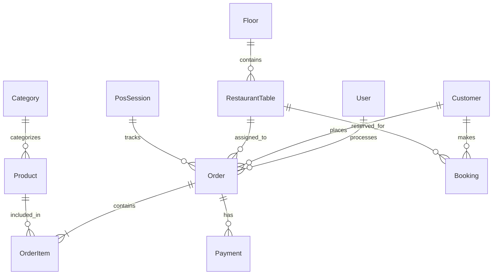

# GatherPoint - Modern Restaurant Management & POS System

[](https://github.com/anshika1179/GatherPoint)
[](https://spring.io/projects/spring-boot)
[](https://react.dev/)
[](https://neon.tech/)

GatherPoint is a full-stack, enterprise-grade Restaurant Point-of-Sale (POS) and Management System designed for modern dining establishments. It seamlessly integrates POS operations, offline selling with background synchronization, real-time Kitchen Display Systems (KDS), floor/table management, online customer bookings, session management, and analytics reports.

---

## Team Members

- **Team Leader**: Anshika Rai
- **Team Members**:
  - Atul Upadhyay
  - Satyam Kumar Singh
  - Khushi Patel

---

## Key Features

### 1. Point of Sale (POS) & Offline Selling
- **Interactive POS Terminal**: Fast product searching, category filtering, cart management, and table selection.
- **Offline Selling Capability**: Staff with offline permissions can accept orders seamlessly without network connectivity using local IndexedDB storage.
- **Background Sync Engine**: Automatically detects network restoration and syncs pending offline transactions to the backend database.

### 2. Kitchen Display System (KDS)
- **Live Ticket Pipeline**: Displays incoming orders real-time organized by status (`PENDING`, `COOKING_IN_PROGRESS`, `COOKING_COMPLETED`).
- **WebSocket Push Notifications**: Instant order updates pushed to kitchen displays without page polling using Spring WebSocket STOMP protocol.

### 3. Floor & Table Management
- Dynamic table grid and floor layout visualization.
- Real-time table occupancy tracking (`AVAILABLE`, `OCCUPIED`, `RESERVED`).
- Assign orders directly to restaurant tables.

### 4. Customer Portal & Table Booking
- Online digital menu for customers.
- Table reservation system with instant confirmation.
- Customer authentication via Clerk & Google OAuth2.

### 5. Payments & Session Management
- Multi-payment support (Cash, Card, Razorpay Payment Gateway integration).
- POS Shift/Session management (Opening balance, closing balance cash drawer tracking, and audit reports).

### 6. Analytics & Admin Reports
- Real-time sales performance metrics, order volume tracking, and revenue summaries.
- Employee management with role-based permissions (`ADMIN`, `EMPLOYEE`, `KITCHEN_STAFF`).

---

## System Architecture



---

## Technology Stack

### Frontend
- **Framework**: React 19, Vite
- **Styling**: Tailwind CSS, Framer Motion, GSAP
- **Icons**: Lucide React
- **State & Data Handling**: React Query, Custom Hooks
- **Auth Integrations**: Google OAuth2, Clerk Authentication

### Backend
- **Framework**: Java 21 / 23, Spring Boot 4.1
- **Security**: Spring Security, JWT (JSON Web Tokens), OAuth2 Client & Resource Server
- **Persistence**: Spring Data JPA, Hibernate ORM, PostgreSQL (Neon DB)
- **Real-Time Communication**: Spring WebSocket with STOMP message broker
- **Utilities & Tools**: Lombok, Maven, Razorpay Java SDK

---

## Core Database Model Schema



---

## API Routes Summary

### Authentication (`/api/auth`)
- `POST /api/auth/login` - Authenticate staff/admin & receive JWT
- `POST /api/auth/register` - Create new user account
- `GET /api/auth/profile` - Fetch authenticated user details

### Orders (`/api/orders`)
- `GET /api/orders` - List all orders (filterable by status/date)
- `POST /api/orders` - Place a new order
- `POST /api/orders/offline-sync` - Batch sync offline orders
- `PUT /api/orders/{id}/status` - Update order status (`COOKING_IN_PROGRESS`, `COMPLETED`, etc.)

### Kitchen (`/api/kitchen`)
- `GET /api/kitchen/tickets` - Fetch active kitchen tickets
- `PATCH /api/kitchen/tickets/{id}/status` - Advance ticket status

### Tables & Floors (`/api/tables`, `/api/floors`)
- `GET /api/floors` - Fetch floor map with tables
- `POST /api/tables` - Add new table configuration

### Payments (`/api/payments`, `/api/razorpay`)
- `POST /api/razorpay/create-order` - Create Razorpay transaction order
- `POST /api/razorpay/verify` - Verify payment signature

---

## Getting Started & Local Setup

### Prerequisites
- **Java**: JDK 21 or higher
- **Node.js**: v18.0 or higher
- **Maven**: (Maven Wrapper `mvnw` included in backend)

---

### 1. Clone Repository
```bash
git clone https://github.com/anshika1179/GatherPoint.git
cd GatherPoint
```

---

### 2. Backend Setup
1. Navigate to the backend directory:
   ```bash
   cd backend
   ```
2. Verify environment configuration in `backend/.env`:
   ```env
   DB_URL=jdbc:postgresql://<YOUR_HOST>:5432/<YOUR_DB>?sslmode=require
   DB_USERNAME=<YOUR_USERNAME>
   DB_PASSWORD=<YOUR_PASSWORD>
   JWT_SECRET=your_super_secret_jwt_key
   ```
3. Run Spring Boot application:
   ```bash
   ./mvnw spring-boot:run
   ```
   The backend server will start at `http://localhost:8080`.

---

### 3. Frontend Setup
1. Navigate to the frontend directory:
   ```bash
   cd ../frontend
   ```
2. Install dependencies:
   ```bash
   npm install
   ```
3. Start Vite development server:
   ```bash
   npm run dev
   ```
   The frontend app will be accessible at `http://localhost:5173` (or `http://localhost:5174`).

---

## Repository Structure

```
GatherPoint/
├── backend/
│   ├── src/main/java/com/GatherPoint/backend/
│   │   ├── config/          # Security, Web & Database Config
│   │   ├── controller/      # REST API Endpoints
│   │   ├── dto/             # Data Transfer Objects (Requests/Responses)
│   │   ├── Mapper/          # Entity <-> DTO Mappers
│   │   ├── Model/           # JPA Entities (Order, User, Product, etc.)
│   │   ├── Repo/            # Spring Data Repositories
│   │   └── Security/        # JWT & OAuth2 Handlers
│   ├── pom.xml              # Maven Dependencies
│   └── .env                 # Backend Configuration
├── frontend/
│   ├── src/
│   │   ├── components/      # POS, KDS, Admin, Tables, Booking Components
│   │   ├── context/         # AuthContext & Session State
│   │   ├── pages/           # Admin & Employee Views
│   │   ├── services/        # API Service & Offline Order Engine
│   │   └── main.jsx         # React Entry Point
│   ├── package.json
│   └── vite.config.js
└── README.md
```

---

## License
Distributed under the MIT License. See `LICENSE` for details.
